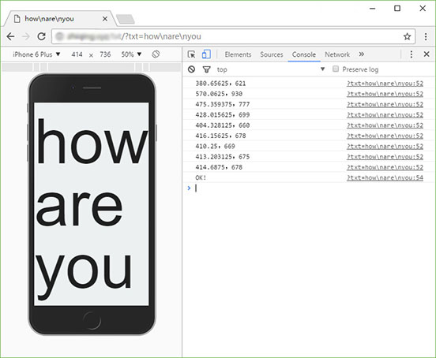

### html-big-text
show full screen text by adjusting font size with bisection method on the html web page.

### Usage

GET Parameters: 

`txt` the text to show, use "\n" to change line

`ratio` default 1

Examples:

`/?txt=hello` this will show the big text "hello"
`/?txt=hello\nworld&ratio=.8` this will show the big text "hello\word" with a ratio of 0.8

### demo

